# Spring Data JPA & Hibernate Hands-on

**Completed by:** Prince

**Application Name:** `EmployeeManagementSystem`

**Package Name:** `com.princechouhan.employeemanagementsystem`

---

# Overview

This project demonstrates the implementation of **Spring Data JPA** and **Hibernate** using **Spring Boot 3**. It covers entity mapping, repository creation, CRUD operations, query methods, pagination, sorting, entity auditing, projections, datasource configuration, and Hibernate-specific optimizations.

The application follows the **Layered Architecture**:

```text
Controller
      │
      ▼
Service
      │
      ▼
Repository (Spring Data JPA)
      │
      ▼
H2 Database
```

---

# Technologies Used

* Spring Boot 3
* Spring Data JPA
* Hibernate ORM
* Spring Web
* H2 Database
* Lombok
* SLF4J Logging
* Maven
* IntelliJ IDEA

---

# Exercise 1 – Employee Management System Overview & Setup

### Implemented

* Spring Boot project initialization
* H2 in-memory database configuration
* Spring Data JPA setup
* Spring Web dependency
* Lombok integration
* Application properties configuration

### Important Annotations

```java
@SpringBootApplication
@EnableJpaRepositories
@EntityScan
```

### Output

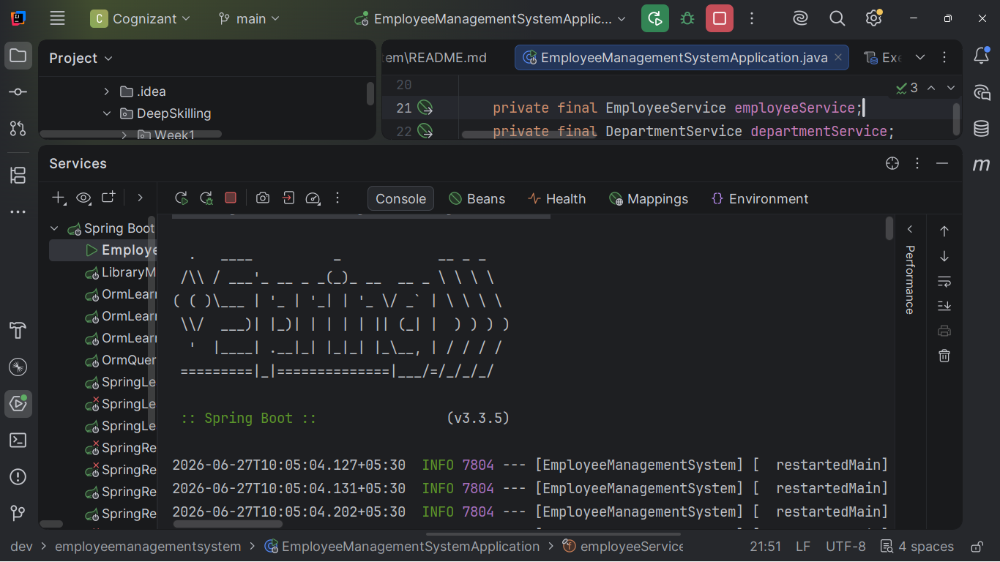
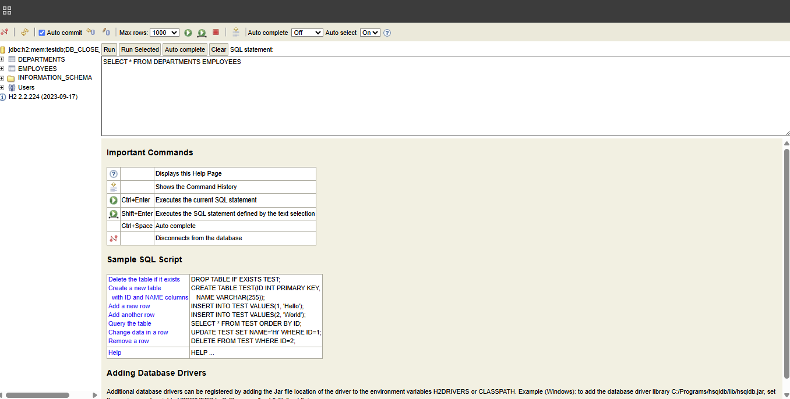

---

# Exercise 2 – Creating JPA Entities

### Implemented

* Employee Entity
* Department Entity
* One-to-Many Relationship
* Many-to-One Relationship
* Builder Pattern

### JPA Annotations Used

```java
@Entity
@Table
@Id
@GeneratedValue
@Column
@OneToMany
@ManyToOne
@JoinColumn
```

### Lombok Annotations

```java
@Builder
@Getter
@Setter
@NoArgsConstructor
@AllArgsConstructor
```

### Output

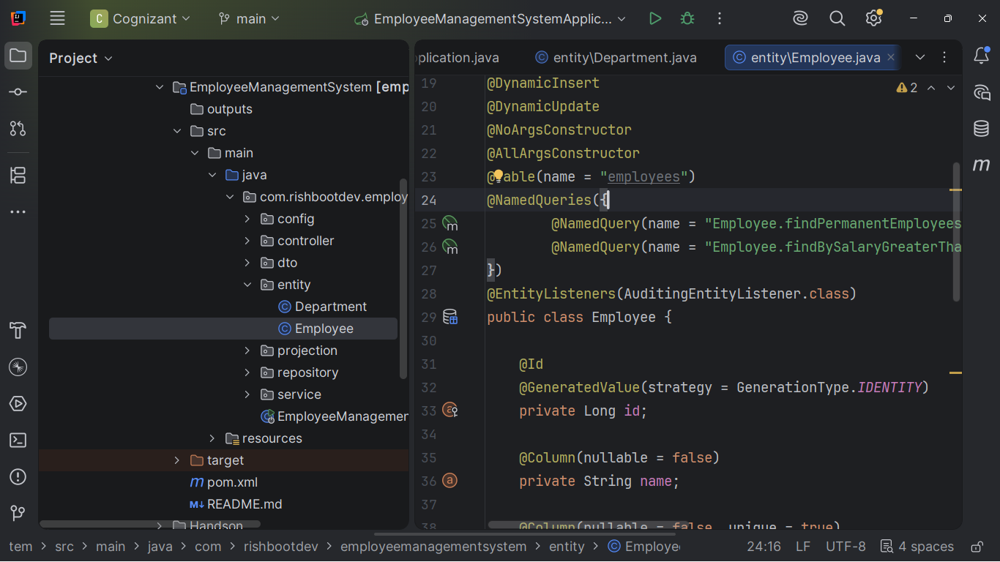

---

# Exercise 3 – Creating Repositories

### Implemented

* EmployeeRepository
* DepartmentRepository
* CRUD operations using JpaRepository
* Derived Query Methods

### Repository Interfaces

```java
@Repository
JpaRepository<Employee, Integer>
JpaRepository<Department, Integer>
```

### Output

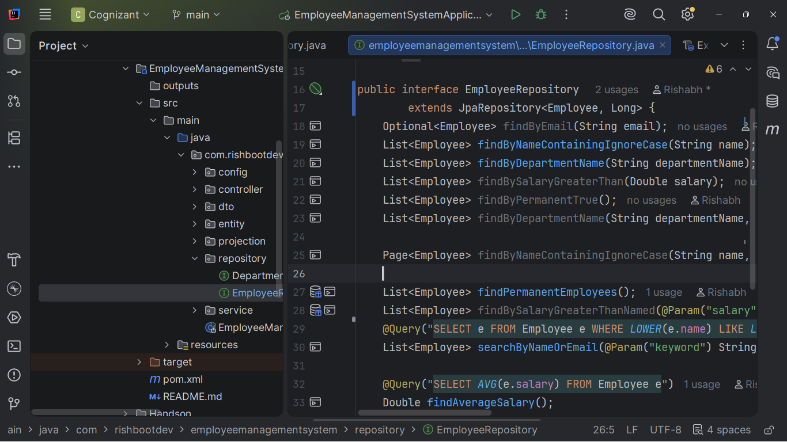

---

# Exercise 4 – CRUD Operations

### Implemented

* Create Employee
* Read Employee
* Update Employee
* Delete Employee
* Department CRUD Operations
* REST Controllers

### Spring Annotations Used

```java
@RestController
@RequestMapping
@GetMapping
@PostMapping
@PutMapping
@DeleteMapping
@RequestBody
@PathVariable
```

### Output

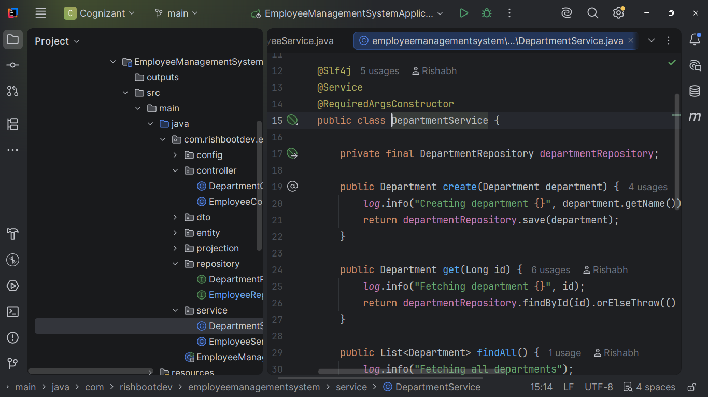
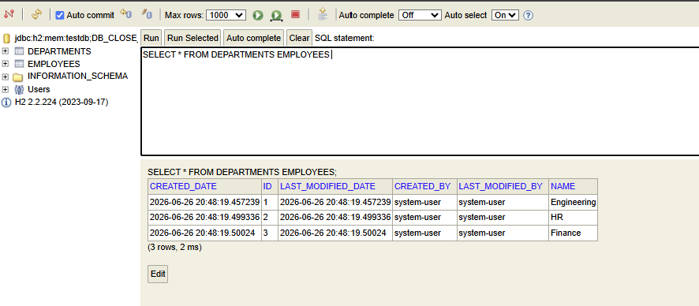

---

# Exercise 5 – Query Methods

### Implemented

* Derived Query Methods
* JPQL Queries
* Native Queries
* Named Queries

### Annotations Used

```java
@Query
@NamedQuery
@NamedQueries
```

### Example Repository Methods

```java
findByName()

findByDepartmentName()

findByEmailContaining()

findBySalaryGreaterThan()
```

### Output


---

# Exercise 6 – Pagination & Sorting

### Implemented

* Pagination
* Sorting
* Pageable Search
* Page Response

### Spring Classes Used

```java
Page
Pageable
PageRequest
Sort
```

### Output

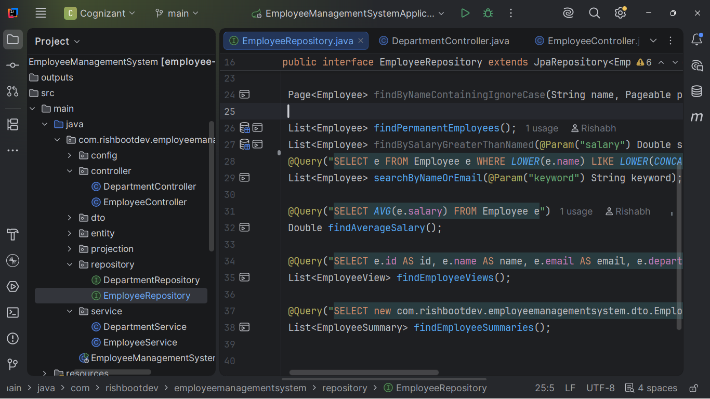

---

# Exercise 7 – Entity Auditing

### Implemented

* Creation Timestamp
* Modification Timestamp
* Created By
* Modified By

### Auditing Annotations Used

```java
@EnableJpaAuditing

@EntityListeners

@CreatedDate

@LastModifiedDate

@CreatedBy

@LastModifiedBy
```

### Output

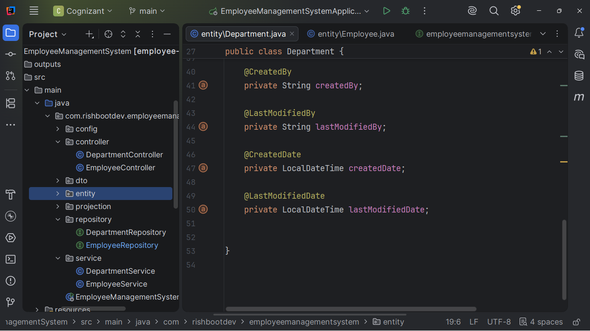

---

# Exercise 8 – Projections

### Implemented

* Interface-based Projection
* DTO Projection
* Constructor Projection

### Annotation Used

```java
@Value
```

### Projection Types

* Interface-based Projection
* Class-based Projection
* DTO Projection

### Output

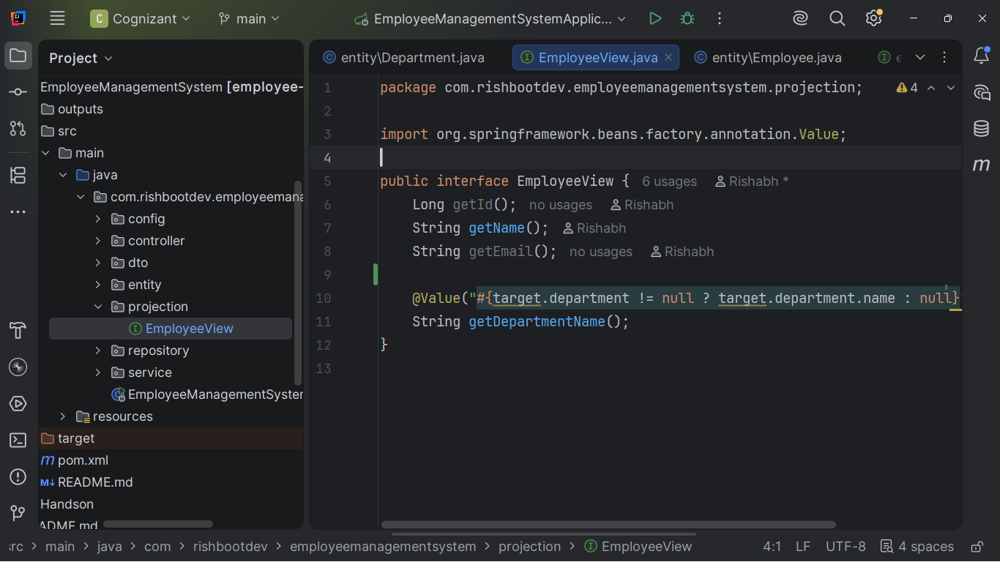

---

# Exercise 9 – Data Source Configuration

### Implemented

* Spring Boot Auto Configuration
* Externalized Configuration
* Multiple Data Source Configuration

### Configuration Properties

```properties
spring.datasource.*

spring.jpa.*

spring.jpa.hibernate.*

spring.jpa.properties.*
```

### Output

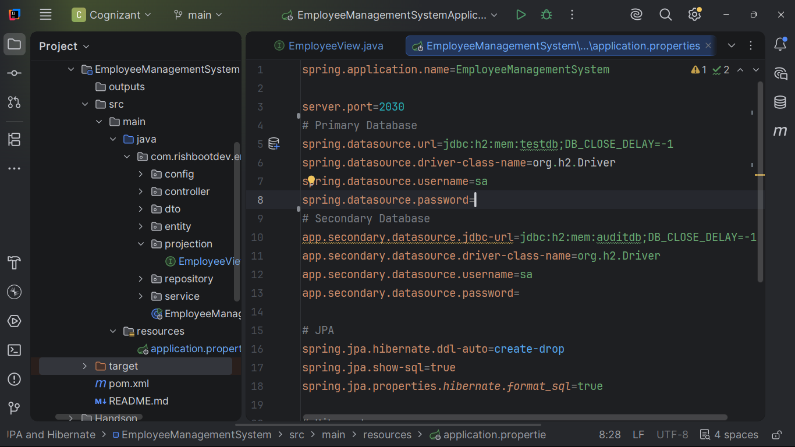

---

# Exercise 10 – Hibernate Specific Features

### Implemented

* Hibernate Dialect Configuration
* Batch Processing
* SQL Optimization
* Entity Customization

### Hibernate Annotations Used

```java
@DynamicInsert

@DynamicUpdate

@CreationTimestamp

@UpdateTimestamp
```

### Hibernate Features

* Batch Processing
* SQL Optimization
* Automatic Dirty Checking
* First-Level Cache
* Entity Lifecycle Management

### Output

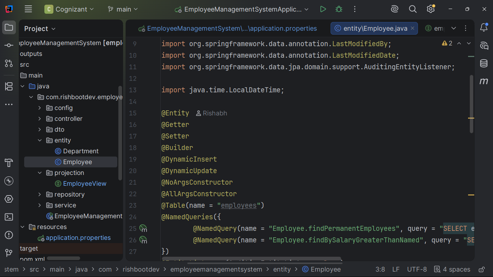
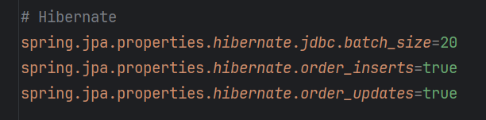

---

# Features Implemented

* Spring Boot 3
* Layered Architecture
* Spring Data JPA
* Hibernate ORM
* RESTful APIs
* Entity Relationships
* Repository Pattern
* CRUD Operations
* JPQL Queries
* Native Queries
* Named Queries
* Pagination
* Sorting
* Entity Auditing
* Interface-based Projections
* DTO Projections
* Multiple Data Source Configuration
* Hibernate Optimizations
* Builder Pattern
* Lombok Integration
* SLF4J Logging

